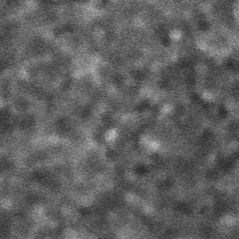

# Description

This is a software implementation for the paper "**Artificial intelligence assisted clinical fluorescence imaging achieves in vivo cellular resolution comparable to adaptive optics ophthalmoscopy**".

# System Requirements

### Prerequisites

- Windows 10
- NVIDIA GPU +CUDA (tested on NVIDIA TITAN V, CUDA 11.7)

# Demo 

### Test

- Run `python main.py` to test the model.

  

  

- To test the model, Click on the  `Test` button.

- In  `Open test directory ` tab, select the folder  `./data/` which contains two subfolders:  `AO_images`  and  `spectralis30_images` . 

  

  

- In  `Training weights ` tab, select the folder  `./saved_models/20200225-180644_labelcyclegan` .

- Click OK.

- The generated images are automatically saved in `./generate_images` .

# Example Images

- Conventional indocyanine green (ICG) image of the RPE cells 

  

- Stratified CycleGAN enhanced RPE cells (AI-ICG)

  
  
- Adaptive optics image of RPE cells (AO-ICG, Ground truth)

  

